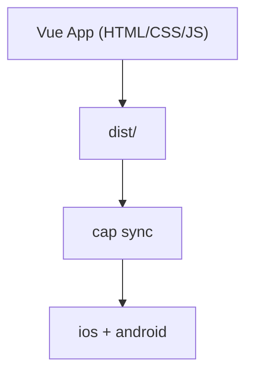

# Was ist Capacitor.js?

::left::

::right::

<v-clicks>

- Native Runtime von Ionic für Webanwendungen
- Compiled Anwendungen aus Vue, Nuxt oder Vite als iOS- und Android-App
- Zugriff auf Gerätefunktionen über Plugins (z. B. Kamera, GPS, Dateisystem)
- Eine gemeinsame Codebasis für Web und Mobile

</v-clicks>

<!--
- Capacitor ist eine Runtime/Bridge, kein eigenes UI-Framework.
- Ziel ist eine gemeinsame Codebasis fuer Web und Mobile.
- Plugins geben Zugriff auf native Funktionen wie Kamera, GPS, Push.
- Typischer Einsatz: Teams mit Web-Stack wollen mobile Apps liefern.
-->

---
layout: two-cols-header
---

# Wie funktioniert Capacitor?

::left::

<v-clicks>

- Zunächst wird die Webanwendung gebaut (`dist/`)
- Capacitor kopiert das Build-Ergebnis in native Projekte (`ios/`, `android/`)
- Eine native Shell stellt die Anwendung in einer WebView bereit
- Plugins vermitteln zwischen JavaScript und nativen APIs

</v-clicks>

::right::

<!--
- Build-Output der Web-App wird in native Projekte uebernommen.
- App laeuft in einer WebView, eingebettet in eine native Shell.
- Plugins uebersetzen zwischen JavaScript und nativen APIs.
- Dadurch bleibt der groesste Teil der Logik im Web-Code.
-->

---
layout: two-cols-header
---

# Vor- und Nachteile

::left::

## Vorteile

<v-clicks>

- Schneller Übergang von Web zu mobilen Plattformen
- Weiterverwendung bestehender Vue- und TypeScript-Kompetenzen im Team
- Plugins für viele Standardfunktionen sind verfügbar
- Besonders geeignet für Business-Anwendungen und interne Tools

</v-clicks>

::right::

## Nachteile

<v-clicks>

- Eine stark plattformspezifische UI/UX erfordert zusätzliche Anpassungen
- Bei Plugin-Lücken kann die Entwicklung eigener nativer Plugins notwendig sein
- Build-, Signatur- und Store-Prozesse bleiben weiterhin komplex

</v-clicks>

<!--
- Vorteile: schneller Start, Wiederverwendung von Vue/TS, viele Standard-Plugins.
- Nachteile: Native UI/UX erfordert zusaetzliches Feintuning.
- Bei Plugin-Luecken sind eigene native Erweiterungen noetig.
- Performance-Grenzen bei grafikintensiven Apps moeglich.
-->

---
layout: center
---

# Development Workflow

<v-clicks>

1. Webanwendung entwickeln (`pnpm dev`)
2. Produktions-Build erzeugen (`pnpm build`)
3. Capacitor initialisieren (`npx cap init`)
4. Plattform hinzufügen (`npx cap add ios` / `npx cap add android`)
5. Änderungen synchronisieren (`npx cap sync`)
6. Native Projekt starten (`npx cap open ios` / `npx cap open android`)
7. In Xcode bzw. Android Studio bauen, testen und signieren

</v-clicks>

<!--
- Workflow: Web entwickeln, Build erzeugen, syncen, dann in Xcode/Android Studio.
- Store-/Signatur-Prozesse bleiben wie bei nativen Apps.
- Iteration laeuft oft schneller ueber Web-Preview, native Builds fuer echte Tests.
-->
